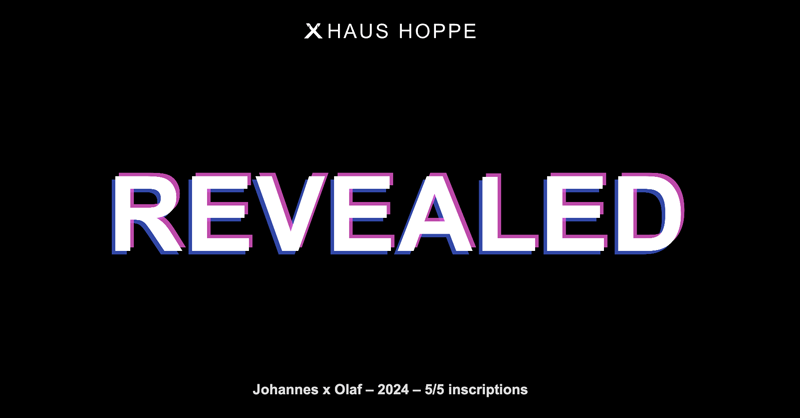

Johannes x Olaf – 2024 – 5/5 inscriptions.

### Used libs

* [p5.js v1.9.0](https://ordpool.space/tx/b6a50f5ba932b0ea7f652d9d28e59eced47bc6f8376c25e02d8b3457bb60ac8fi0) by [processing/p5.js](https://github.com/processing/p5.js) inscribed by [TheWizardsOfOrd/Elements](https://github.com/TheWizardsOfOrd/Elements) 
* [p5.glitch.js v0.1.3](https://ordpool.space/tx/a499bb004988202e0e4e6be6dbe9a8dd28fc9565b5182f78a25cfea7d4ee4c67) by [ffd8/p5.glitch](https://github.com/ffd8/p5.glitch) inscribed by Johannes
* [tone.js 14.7.77](https://ordpool.space/tx/44740a1f30efb247ef41de3355133e12d6f58ab4dc8a3146648e2249fa9c6a39) by [Tonejs/Tone.js](https://github.com/Tonejs/Tone.js) inscribed by Ordvision Labs

More libs here

* https://github.com/jokie88/ordinalpublicgoods
* https://github.com/boppleton/inscribed-packages